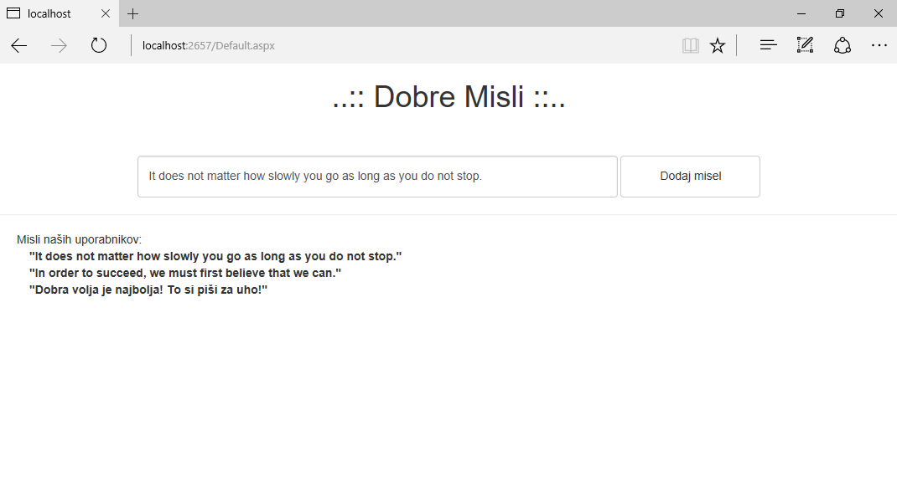

# Portal Dobre misli

V okviru predmeta Informacijski sistemi izdelujemo portal za prikazovanje dobrih misli, ki vsebuje sledeče funkcionalnosti:

* Dodajanje vnešenih misli med vsemi uporabniki.
* Prikazovanje misli.
* Hranjenje misli le v času delovanja strežnika (misli niso trajno shranjene).

**TODO:** Projekt še ni dokončan, zato ga ustrezno dokončajte. Vsaka nova misel naj se doda kot *Label* na vrhu polja *misli*. Vnešene misli morajo biti vidne vsem uporabnikom.